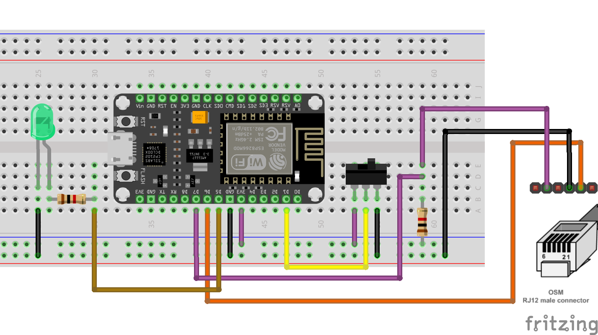
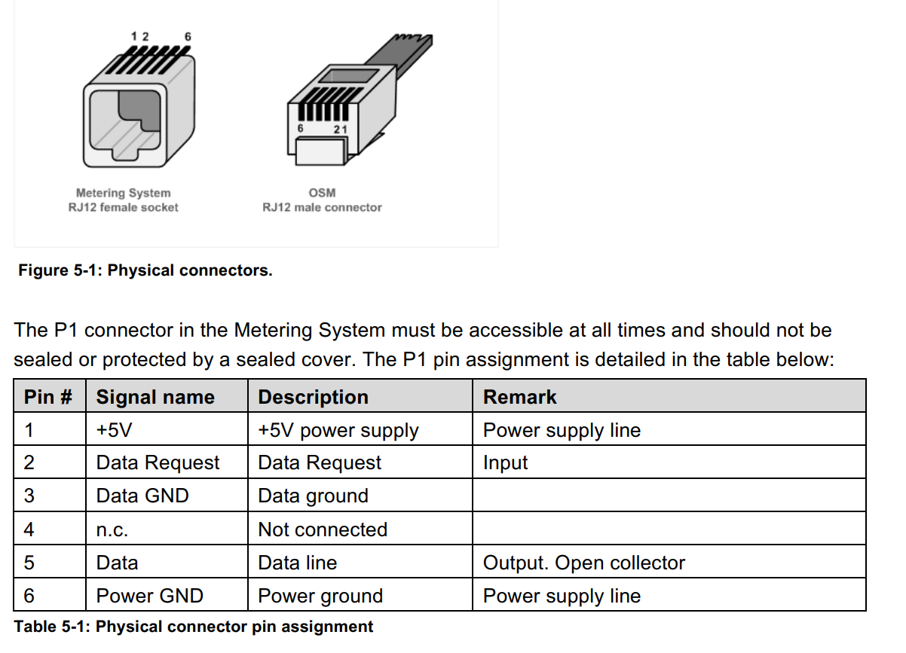
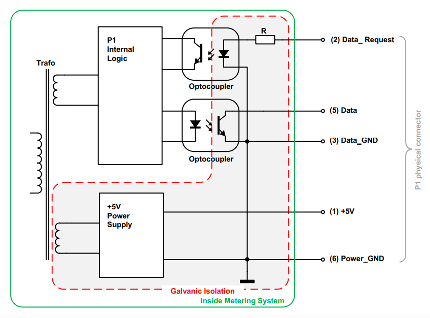

# classic_dsmr_meter
Classic analog meter on the (dutch) DSMR meter + ESP8266 mqtt connection.

# Wiring diagram
Notes:
* The RXD0 & TXD0 pins are hardwired to the onbouard USB-Serial converter and cannot be used to connect to the P1 port. A Serial.swap() command is part of the code to switch to RXD2 & TXD2 pins.
* The P1 meter signal is inverted. Therefore the UART Rx function is inverted in the code.
* The UART TX is NOT inverted. So serial logging still can be monitored (now on TXD2 pin, so seperate USB-Serial converter is needed).
* The switch is used to force the "WifiManager" to start, even if valid WIFI credentials were found.

# Datasheet screenshots

